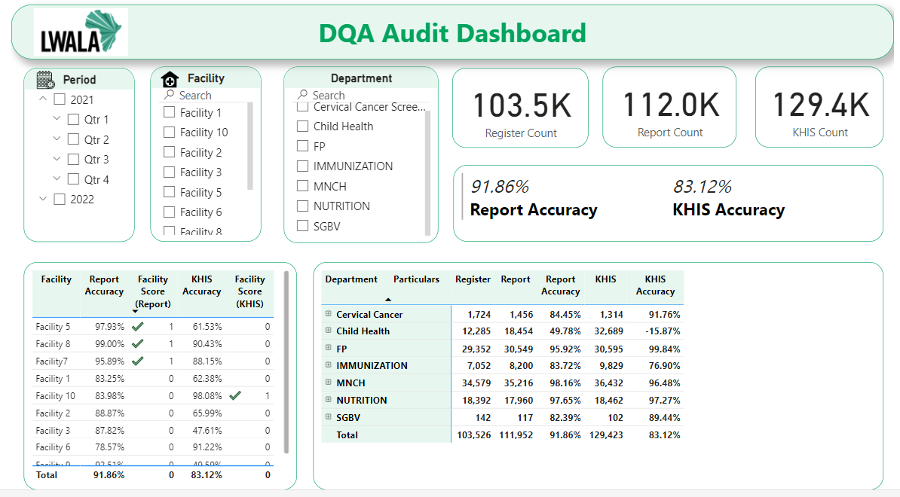
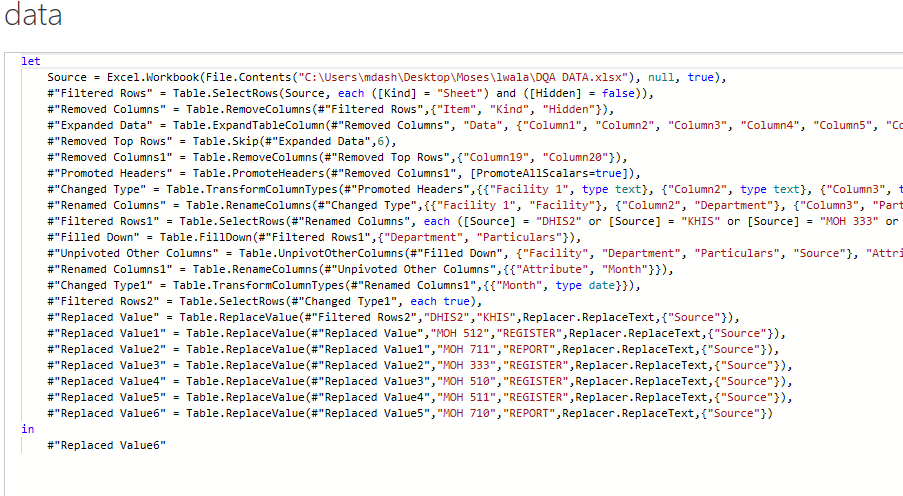
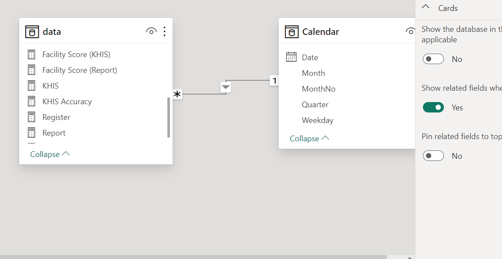

## Data Quality PBI Assessment Dashboard

Lwala is a community based organisation located in Rongo Subcounty, Migori. Its mandate is to provide health services to the community of Lwala village in Rongo. With the provided dataset from Kenya Health Information System, develop a dynamic dashboard that can be refreshed with new data as it comes available.
Get percentage difference comparing registers against reports, as well as reports against KHIS
Calculate the average facility data accuracy score, taking into consideration that if the indicator percentage difference falls within the margin error of -5% to 5%, it is scored as 1, anything outside that range is scored as 0. 
Create interactive visual dashboard. 

**_Disclaimer_** ; _All data used in this project is dummy_ 

---

---

### Data source

- [KHIS](https://hiskenya.org/dhis-web-commons/security/login.action#/)

---

### Tools

- Excel for data cleaning 
- Power BI for visualization

---

### Data transformation

- Data loanding and transformation in power query

- Handling missing values

---

### Results/Findings

- Report accuracy 91.85%

- KHIS accuracy 83.12%

---

### Recomendations

- Ensure that routine DQA is done within the facilities (monthly)

- Train records officers on data management skills

- Adhere to data quality dimensions

---

### Limitations

- Missing values

- Abreviations of terms

---

### Skills

- Callendar table creation
 
- DAX 

- Filter  

- Modeling of 2 tables and creating one to many relationship

---

### References

- Data Analysis Expressions (DAX) Reference

- [Lwala website](https://lwala.org/)

---

### Live dashboard

You can view and interact with the report [Here](https://app.powerbi.com/links/V2-Ywe1eKa?ctid=e8f03421-acdb-4190-87c4-2e45dacd2d1a&pbi_source=linkShare)

